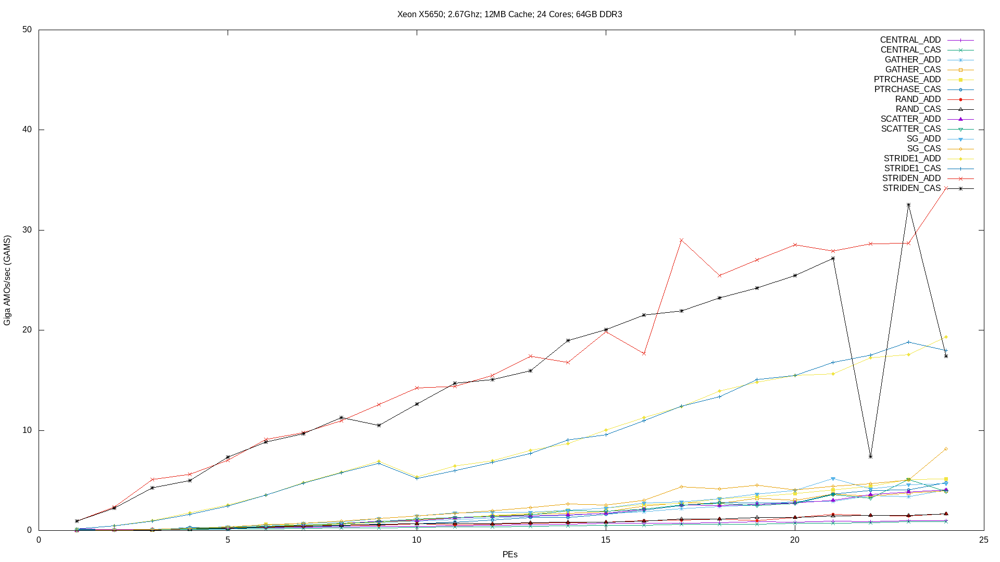
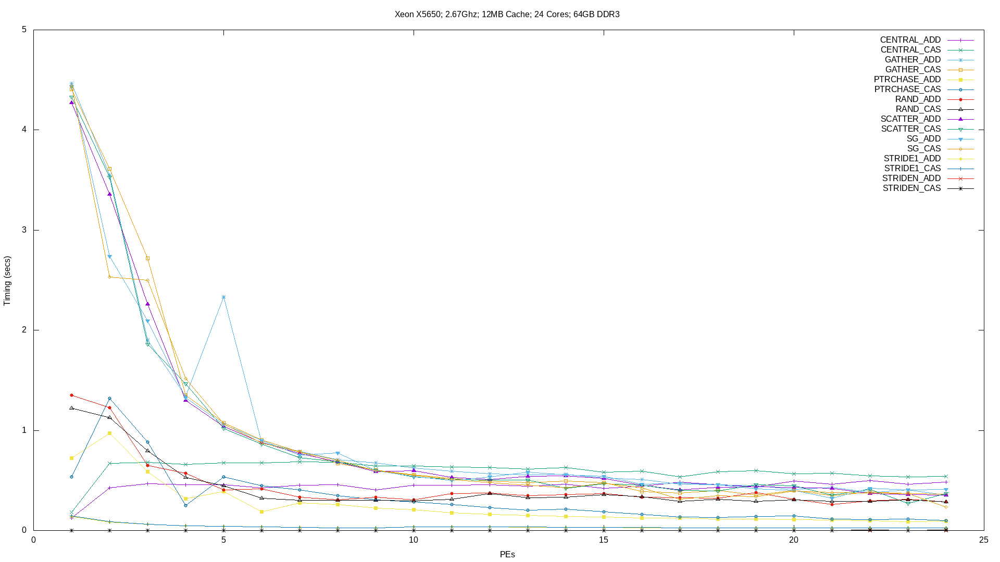

# CircusTent: Atomic Memory Operation System Benchmarks

[](https://raw.githubusercontent.com/tactcomplabs/circustent/master/LICENSE)


## Overview

The CircusTent infrastructure is designed to provide users and architects
the ability to discover the relevant performance of a target system
architecture's memory subsystem using atomic memory operations.  Atomic
memory operations have traditionally been considered to be latent or
low performance given the difficulty in their respective implementations.  
However, atomic operations are widely utilized across parallel programming
constructs for synchronization primitives and to promote concurrency.  However,
prior to the creation of CircusTent, the architecture and programming
model communities had little ability to quantify the performance of
atomics on varying scales of a system architecture.

The CircusTent infrastructure is designed to be a modular benchmark
platform consisting of a frontend and backend infrastructure.  
The frontend infrastructure defines the various benchmark types and
standard benchmark algorithms as well as providing the command line
execution interface.  The backend provides one or more implementations
of the standard algorithms using various programming models.  

## Building From Source

### Prerequisites

The following packages/utilities are required to build CircusTent from source:
* CMake 3.4.3+
* C++ Compiler
* C Compiler

Optional packages include:
* RPM tools to build RPMs
* Debian package tools to build DEBs
* Backend-specific libraries

### Building

The following steps are generic build instructions.  You may need to
modify these steps if you desire to enable external backends
and/or utilize non-GCC compilers.

1. Clone the CircusTent repository
```
git clone https://github.com/tactcomplabs/circustent.git
```
2. Setup your build tree
```
cd circustent
mkdir build
cd build
```
3. Execute CMake to generate the makefiles (where XXX refers to the backend that you want to enable)
```
cmake -DENABLE_XXX=ON ../
```
4. Execute the build
```
make
```
The `circustent` binary will reside in ./src/CircusTent/

5. (Optional) Install the build
```
make install
```

### Build Options
The following are additional build options supported by the CircusTent CMake script
* CC : Utilize the target C compiler
* CXX : Utilize the target C++ compiler
* -DCMAKE\_C\_FLAGS : Set the C compiler flags
* -DCMAKE\_CXX\_FLAGS : Set the C++ compiler flags
* -DCT\_CFLAGS : Append the CT\_CFLAGS to the standard C\_FLAGS for the target Impl
* -DCT\_CXXFLAGS : Append the CT\_CXXFLAGS to the standard CXX\_FLAGS for the target Impl
* -DCMAKE\_INSTALL\_PREFIX : installation target (make install)
* -DCIRCUSTENT\_BUILD\_RPM : Builds an RPM package
* -DCIRCUSTENT\_BUILD\_DEB : Builds a DEB package
* -DCIRCUSTENT\_BUILD\_TGZ : Builds a TGZ package
* -DBUILD\_ALL\_TESTING : Builds the test infrastructure (developers only)

## Algorithm Descriptions

The following contains brief descriptions of each candidate algorithm.  For each algorithm,
we apply one or more of the following atomics:
* Fetch and Add (ADD)
* Compare and Exchange (CAS)

The algorithmic descriptions below do not specify the size of the data values
implemented.  The CircusTent software does not derive bandwidth.  However,
we highly suggest that implementors utilize 64-bit values for the source
and index portions of the benchmark.  

The following table presents all the core benchmarks and the number of
atomic operations performed for each (which is vital to calculating
accurate GAMs values across platforms).

| Benchmark | Number of AMOs |
| ------ | ------ |
| RAND | 1 |
| STRIDE1 | 1 |
| STRIDEN | 1 |
| PTRCHASE | 1 |
| CENTRAL | 1 |
| SG | 4 |
| SCATTER | 3 |
| GATHER | 3 |

### RAND
Performs a stride-1 atomic update using an index array with randomly generated
indices and a source value array.  The index array (IDX) must contain valid indices
within the bounds of the source value array (ARRAY).  Utilizing standard-C
linear congruential methods is sufficient.
```
for( i=0; i<iters; i++ ){
    AMO(ARRAY[IDX[i]])
}
```

### STRIDE1
Performs a stride-1 atomic update using only a source array (ARRAY).  
```
for( i=0; i<iters; i++ ){
    AMO(ARRAY[i])
}
```

### STRIDEN
Performs a stride-N atomic update using only a source array (ARRAY).  
The user must specify the respective stride of the operation
```
for( i=0; i<iters; i+=stride ){
    AMO(ARRAY[i])
}
```

### PTRCHASE
Performs a pointer chase operation across an index array.  This implies
that the i'th+1 value is selected from the i'th operation.  This algorithm
only utilizes the index array (IDX).  All index values must be valid within the
scope of the index array.  
```
for( i=0; i<iters; i++ ){
    start = AMO(IDX[start])
}
```

### CENTRAL
Performs an atomic operation to a singular value from all PEs.  This is a deliberate
hot-spot action that is designed to immediately stress system and network
interconnects.
```
for( i=0; i<iters; i++ ){
    AMO(ARRAY[0])
}
```

### SG
Performs a scatter and a gather operation.  The source values for the scatter,
gather and the final values are all fetched atomically.  As with the other
algorithms, the source array and index array must be valid.
```
for( i=0; i<iters; i++ ){
    src = AMO(IDX[i])
    dest = AMO(IDX[i+1])
    val = AMO(ARRAY[src])
    AMO(ARRAY[dest], val) // ARRAY[dest] = val
}
```

### SCATTER
Performs the scatter portion of an SG operation.  As with the other
algorithms, the source array and index array must be valid.
```
for( i=0; i<iters; i++ ){
    dest = AMO(IDX[i+1])
    val = AMO(ARRAY[i])
    AMO(ARRAY[dest], val) // ARRAY[dest] = val
}
```

### GATHER
Performs the gather portion of an SG operation.  As with the other
algorithms, the source array and index array must be valid.
```
for( i=0; i<iters; i++ ){
    dest = AMO(IDX[i+1])
    val = AMO(ARRAY[dest])
    AMO(ARRAY[i], val) // ARRAY[i] = val
}
```


## Backends
### OMP
* CMake Build Flag: -DENABLE_OMP=ON
* Implementation Language: C++ & C using GNU intrinsics
* Utilizes unsigned 64-bit integers for the ARRAY and IDX values
* Utilizes \_\_ATOMIC\_RELAXED where appropriate
* Intrinsic documentation: [GNU Atomics](https://gcc.gnu.org/onlinedocs/gcc/_005f_005fatomic-Builtins.html)

| Benchmark | Supported? |
| ------ | ------ |
| RAND_ADD | yes |
| RAND_CAS | yes |
| STRIDE1_ADD | yes |
| STRIDE1_CAS | yes |
| STRIDEN_ADD | yes |
| STRIDEN_CAS | yes |
| PTRCHASE_ADD | yes |
| PTRCHASE_CAS | yes |
| CENTRAL_ADD | yes |
| CENTRAL_CAS | yes |
| SG_ADD | yes |
| SG_CAS | yes |
| SCATTER_ADD | yes |
| SCATTER_CAS | yes |
| GATHER_ADD | yes |
| GATHER_CAS | yes |

### OMP with Target Offloading
* CMake Build Flags: -DENABLE_OMP_TARGET=ON -DOFFLOAD_TARGETS=target_options
where "target_options" is passed to the GNU -foffload compiler flag
* Implementation Language: C++ & C using GNU intrinsics
* Users may define $OMP_DEFAULT_DEVICE to select a different target device ID,
otherwise the system default is utilized
* Maps provided PEs argument to team-level parallelism, iterations for a given team
are automatically subdivided across threads within each team
* Utilizes unsigned 64-bit integers for the ARRAY and IDX values
* Utilizes \_\_ATOMIC\_RELAXED where appropriate
* Intrinsic documentation: [GNU Atomics](https://gcc.gnu.org/onlinedocs/gcc/_005f_005fatomic-Builtins.html)

| Benchmark | Supported? |
| ------ | ------ |
| RAND_ADD | yes |
| RAND_CAS | yes |
| STRIDE1_ADD | yes |
| STRIDE1_CAS | yes |
| STRIDEN_ADD | yes |
| STRIDEN_CAS | yes |
| PTRCHASE_ADD | yes |
| PTRCHASE_CAS | yes |
| CENTRAL_ADD | yes |
| CENTRAL_CAS | yes |
| SG_ADD | yes |
| SG_CAS | yes |
| SCATTER_ADD | yes |
| SCATTER_CAS | yes |
| GATHER_ADD | yes |
| GATHER_CAS | yes |

### OpenSHMEM
* CMake Build Flag: -DENABLE_OPENSHMEM=ON
* Users must specify the OpenSHMEM compiler wrapper alongside the CMake command as follows:
```
CC=oshcc CXX=oschcxx  cmake -DENABLE_OPENSHMEM=ON ../
```
* Implementation  Language: C++ and C using SHMEM functions and symmetric heap
* Utilizes unsigned 64-bit integers for the ARRAY and IDX values
* Target PE's for all benchmarks except PTRCHASE are initialized in a stride-1 ring pattern.  This implies
that for every N'th PE, the target PE is N+1.  All benchmarks except PTRCHASE target a single destination PE for each iteration
* The PTRCHASE benchmark utilizes randomly generated target PE's for each iteration
* For benchmark values that don't require atomic access to indices, we utilize SHMEM_GET operations to
fetch the index for a given iteration (ex, RAND_ADD, RAND_CAS)
* Tested with OSSS-UCX: [OpenSHMEM Reference Implementation](https://github.com/openshmem-org/osss-ucx)

| Benchmark | Supported? |
| ------ | ------ |
| RAND_ADD | yes |
| RAND_CAS | yes |
| STRIDE1_ADD | yes |
| STRIDE1_CAS | yes |
| STRIDEN_ADD | yes |
| STRIDEN_CAS | yes |
| PTRCHASE_ADD | yes |
| PTRCHASE_CAS | yes |
| CENTRAL_ADD | yes |
| CENTRAL_CAS | yes |
| SG_ADD | yes |
| SG_CAS | yes |
| SCATTER_ADD | yes |
| SCATTER_CAS | yes |
| GATHER_ADD | yes |
| GATHER_CAS | yes |

### MPI
* CMake Build Flag: -DENABLE_MPI=ON
* Users must specify the MPI compiler wrapper alongside the CMake command as follows:
```
CC=mpicc CXX=mpicxx cmake -DENABLE_MPI=ON ../
```
* Implementation  Language: C++ and C using MPI-3 functions and one-sided operations
* Utilizes unsigned 64-bit integers for the ARRAY and IDX values
* Target PE's for all benchmarks except PTRCHASE are initialized in a stride-1 ring pattern.  This implies
that for every N'th PE, the target PE is N+1.  All benchmarks except PTRCHASE target a single destination PE for each iteration
* The PTRCHASE benchmark utilizes randomly generated target PE's for each iteration
* For benchmark values that don't require atomic access to indices, we utilize MPI_Get operations to
fetch the index for a given iteration (ex, RAND_ADD, RAND_CAS)
* Tested with OpenMPI

| Benchmark | Supported? |
| ------ | ------ |
| RAND_ADD | yes |
| RAND_CAS | yes |
| STRIDE1_ADD | yes |
| STRIDE1_CAS | yes |
| STRIDEN_ADD | yes |
| STRIDEN_CAS | yes |
| PTRCHASE_ADD | yes |
| PTRCHASE_CAS | yes |
| CENTRAL_ADD | yes |
| CENTRAL_CAS | yes |
| SG_ADD | yes |
| SG_CAS | yes |
| SCATTER_ADD | yes |
| SCATTER_CAS | yes |
| GATHER_ADD | yes |
| GATHER_CAS | yes |

### xBGAS
* CMake Build Flag: -DENABLE_XBGAS=ON
* Users must ensure the $RISCV environment variable is set to the path of the installed xBGAS toolchain.
* Users must specify the xBGAS compiler alongside the CMake command as follows:
```
CC=riscv64-unknown-elf-gcc CXX=riscv64-unknown-elf-g++ cmake -DENABLE_XBGAS=ON ../
```
* Implementation  Language: C++ and C using xBGAS functions
* Utilizes unsigned 64-bit integers for the ARRAY and IDX values
* Target PE's for all benchmarks except PTRCHASE are initialized in a stride-1 ring pattern.  This implies
that for every N'th PE, the target PE is N+1.  All benchmarks except PTRCHASE target a single destination PE for each iteration
* The PTRCHASE benchmark utilizes randomly generated target PE's for each iteration
* For benchmark values that don't require atomic access to indices, we utilize XBGAS_GET operations to
fetch the index for a given iteration (ex, RAND_ADD, RAND_CAS)

| Benchmark | Supported? |
| ------ | ------ |
| RAND_ADD | yes |
| RAND_CAS | yes |
| STRIDE1_ADD | yes |
| STRIDE1_CAS | yes |
| STRIDEN_ADD | yes |
| STRIDEN_CAS | yes |
| PTRCHASE_ADD | yes |
| PTRCHASE_CAS | yes |
| CENTRAL_ADD | yes |
| CENTRAL_CAS | yes |
| SG_ADD | yes |
| SG_CAS | yes |
| SCATTER_ADD | yes |
| SCATTER_CAS | yes |
| GATHER_ADD | yes |
| GATHER_CAS | yes |

### OpenACC
* CMake Build Flags: -DENABLE_OPENACC=ON -DOFFLOAD_TARGETS=target_options
where "target_options" is passed to the GNU -foffload compiler flag
* Implementation Language: C++ & C using GNU intrinsics
* Users must define both $ACC_DEVICE_TYPE and $ACC_DEVICE_ID to set
the target device type and ID, respectively
* Maps provided PEs argument to gang-level parallelism
* Utilizes unsigned 64-bit integers for the ARRAY and IDX values
* Utilizes \_\_ATOMIC\_RELAXED where appropriate
* Intrinsic documentation: [GNU Atomics](https://gcc.gnu.org/onlinedocs/gcc/_005f_005fatomic-Builtins.html)

| Benchmark | Supported? |
| ------ | ------ |
| RAND_ADD | yes |
| RAND_CAS | yes |
| STRIDE1_ADD | yes |
| STRIDE1_CAS | yes |
| STRIDEN_ADD | yes |
| STRIDEN_CAS | yes |
| PTRCHASE_ADD | yes |
| PTRCHASE_CAS | yes |
| CENTRAL_ADD | yes |
| CENTRAL_CAS | yes |
| SG_ADD | yes |
| SG_CAS | yes |
| SCATTER_ADD | yes |
| SCATTER_CAS | yes |
| GATHER_ADD | yes |
| GATHER_CAS | yes |

### Pthreads
* CMake Build Flags: -DENABLE_PTHREADS=ON
* Implementation Language: C++ & C using GNU intrinsics
* Utilizes unsigned 64-bit integers for the ARRAY and IDX values
* Utilizes \_\_ATOMIC\_RELAXED where appropriate
* Intrinsic documentation: [GNU Atomics](https://gcc.gnu.org/onlinedocs/gcc/_005f_005fatomic-Builtins.html)

| Benchmark | Supported? |
| ------ | ------ |
| RAND_ADD | yes |
| RAND_CAS | yes |
| STRIDE1_ADD | yes |
| STRIDE1_CAS | yes |
| STRIDEN_ADD | yes |
| STRIDEN_CAS | yes |
| PTRCHASE_ADD | yes |
| PTRCHASE_CAS | yes |
| CENTRAL_ADD | yes |
| CENTRAL_CAS | yes |
| SG_ADD | yes |
| SG_CAS | yes |
| SCATTER_ADD | yes |
| SCATTER_CAS | yes |
| GATHER_ADD | yes |
| GATHER_CAS | yes |

### OpenCL
* CMake Build Flags: -DENABLE_OPENCL=ON
* Implementation Language: C++ & C with OpenCL extensions
* Users must define both $OCL_TARGET_PLATFORM_NAME and $OCL_TARGET_DEVICE_NAME to set
the OpenCL target platform and device, respectively
* Utilizes unsigned 64-bit integers (cl_ulong) for the ARRAY and IDX values
* Utilizes OpenCL API-level atomic operations

| Benchmark | Supported? |
| ------ | ------ |
| RAND_ADD | yes |
| RAND_CAS | yes |
| STRIDE1_ADD | yes |
| STRIDE1_CAS | yes |
| STRIDEN_ADD | yes |
| STRIDEN_CAS | yes |
| PTRCHASE_ADD | yes |
| PTRCHASE_CAS | yes |
| CENTRAL_ADD | yes |
| CENTRAL_CAS | yes |
| SG_ADD | yes |
| SG_CAS | yes |
| SCATTER_ADD | yes |
| SCATTER_CAS | yes |
| GATHER_ADD | yes |
| GATHER_CAS | yes |

### C++ Standard Threads & Atomics
* CMake Build Flags: -DENABLE_CPP_STD=ON
* Implementation Language: C++11
* Utilizes unsigned 64-bit integers for the ARRAY and IDX values

| Benchmark | Supported? |
| ------ | ------ |
| RAND_ADD | yes |
| RAND_CAS | yes |
| STRIDE1_ADD | yes |
| STRIDE1_CAS | yes |
| STRIDEN_ADD | yes |
| STRIDEN_CAS | yes |
| PTRCHASE_ADD | yes |
| PTRCHASE_CAS | yes |
| CENTRAL_ADD | yes |
| CENTRAL_CAS | yes |
| SG_ADD | yes |
| SG_CAS | yes |
| SCATTER_ADD | yes |
| SCATTER_CAS | yes |
| GATHER_ADD | yes |
| GATHER_CAS | yes |

## Execution Parameters

### Parameters

The following list comprises the current set of command line options for CircusTent:
* --bench BENCH : specifies the target benchmark to run
* --memsize BYTES : sets the size of the memory array to allocate in bytes (general rule is 1/2 of physical memory)
* --pes PEs : sets the number of parallel execution units (threads, ranks, etc...)
* --iters ITERATIONS : sets the number of algorithmic iterations per PE.  Total iterations = (PEs x ITERATIONS)
* --stride STRIDE : sets the stride (in elements) for the target algorithm.  Not all algorithms require the stride to be specified.  If this value is not required, the algorithm will ignore it.
* --help : prints the help menu
* --list : prints a list of the target benchmarks

### Sample Execution

The following are various examples of utilizing CircusTent for benchmarks

1. Print the help menu
```
circustent --help
```
2. List the benchmark algorithms
```
circustent --list
```
3. Execute the RAND\_ADD algorithm using 1024 bytes of memory, 2 PE's and 1000 iterations
```
circustent -b RAND_ADD -m 1024 -p 2 -i 1000
```
4. Execute the SCATTER\_CAS algorithm using 16GB of memory, 24 PE's and 20,000,000 iterations
```
circustent -b SCATTER_CAS -m 16488974000 -p 24 -i 20000000
```

## Interpreting the Results
For each of the target benchmarks, CircusTent prints two relevant
performance values.  First, the wallclock runtime of the target algorithm
is printed in seconds.  Note that running very small problems with very small
wallclock runtimes may exceed the lower bound of the timing variables.  If
you experience issues in printing the timing, increase the number of iterations
per PE.  An example of the timing printout is as follows:

```
Timing (secs)        : 0.340783
```

The second metric that is printed is the number of billions of atomic
operations per second, or GAMS (Giga AMOs/sec).  This metric derives
the total, parallel number of atomic operations performed in the given
time window.  This value can be utilized to compare platforms based upon
the number of parallel atomics that can be realistically performed using the
target algorithm.  This is derived uniquely for each algorithm as the total
number of atomics performend is equivalent to (NUM\_PEs x NUM\_ITERATIONS x NUM\_AMOs\_PER\_ITER ).
An example of the GAMs printout is as follows:

```
Giga AMOs/sec (GAMS) : 4.22556
```

A sample result set from executing the the OpenMP (OMP) implementation
on a modern, dual socket Intel Xeon system are depicted as follows.
For each of these benchmarks, we utilized the following execution parameters:
* Memsize = 16488974000
* Iterations = 20000000
* PEs = 1 - 24
* Stride (StrideN) = 9




## Adding New Atomic Implementations

See the developer documentation.

## Contributing

All contributions must be made via documented pull requests.  Pull requests will be tested
using the CircusTent development infrastructure in order to ensure correctness and
code stability.  Pull requests may be initially denied for one or more of the following
reasons (violations will be documented in pull request comments):
* Code lacks sufficient documentation
* Code inhibits/breaks existing functionality
* Code does not follow existing stylistic guidelines
* Benchmark implementation violates benchmark rules
* Benchmark implementation cannot be proven to exist (no test systems exist)

## License
CircustTent is licensed under an Apache-style license see the [LICENSE](LICENSE) file for details

## Authors
* *Brody Williams* - *PhD Student* - [Texas Tech University](https://discl.cs.ttu.edu/doku.php)
* *Michael Beebe* - *PhD Student* - [Texas Tech University](https://discl.cs.ttu.edu/doku.php)
* *John Leidel* - *Chief Scientist* - [Tactical Computing Labs](http://www.tactcomplabs.com)
* *David Donofrio* - *Chief Hardware Architect* - [Tactical Computing Labs](http://www.tactcomplabs.com)

## Acknowledgments
* None at this time
